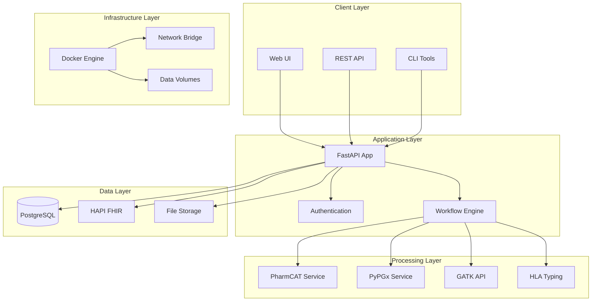
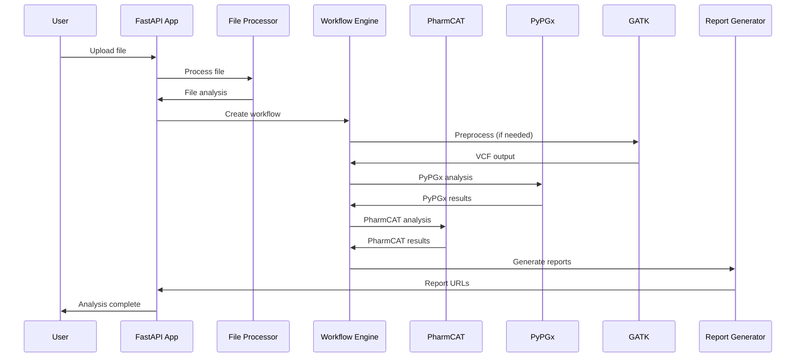
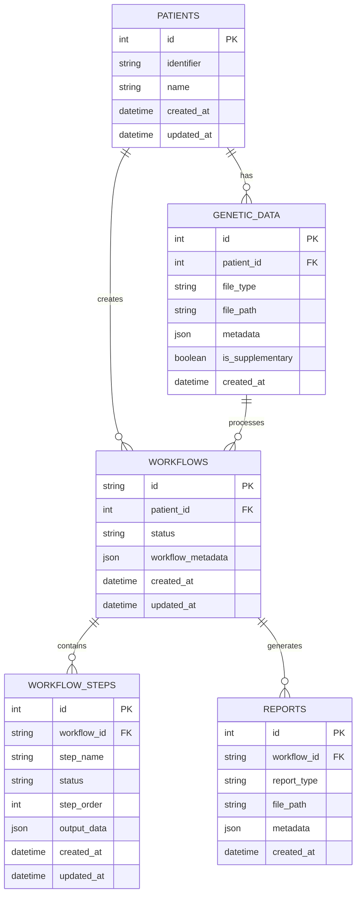

# System Architecture

Detailed technical architecture and design principles of ZaroPGx.

## High-Level Architecture

ZaroPGx is built as a microservices architecture using Docker containers, orchestrated with Docker Compose. The system is designed for scalability, maintainability, and data privacy.

### Core Components



## Service Architecture

### FastAPI Application (`app`)

**Purpose**: Main orchestrator and web interface
**Technology**: Python 3.12, FastAPI, SQLAlchemy
**Port**: 8765 → 8000

**Key Responsibilities:**
- Web UI and API endpoints
- Workflow orchestration
- Database management
- Report generation
- Authentication and authorization

**Key Modules:**
- `app/api/`: API routes and models
- `app/services/`: Background processing
- `app/reports/`: Report generation
- `app/pharmcat/`: PharmCAT integration
- `app/core/`: Core utilities

### PostgreSQL Database (`db`)

**Purpose**: Primary data storage
**Technology**: PostgreSQL 15
**Port**: 5444 → 5432

**Schemas:**
- `public`: Core application data
- `cpic`: CPIC guidelines and data
- `fhir`: FHIR resources
- `user_data`: User and patient data
- `reports`: Generated reports metadata

**Key Tables:**
- `patients`: Patient information
- `genetic_data`: Genomic file metadata
- `workflows`: Analysis workflows
- `workflow_steps`: Individual processing steps
- `reports`: Generated report metadata

### PharmCAT Service (`pharmcat`)

**Purpose**: Pharmacogenomic analysis engine
**Technology**: Java 17, Flask wrapper
**Port**: 5001 → 5000

**Key Features:**
- Star allele calling for 23 core pharmacogenes
- CPIC guideline integration
- Report generation
- PyPGx integration for outside calls

**API Endpoints:**
- `POST /analyze`: Analyze VCF file
- `GET /status/{job_id}`: Check analysis status
- `GET /results/{job_id}`: Get analysis results

### PyPGx Service (`pypgx`)

**Purpose**: Comprehensive allele calling
**Technology**: Python, PyPGx library
**Port**: 5053 → 5000

**Key Features:**
- Star allele calling for 60+ pharmacogenes
- CYP2D6 complex allele calling
- Diplotype and phenotype prediction
- Integration with PharmCAT

**Supported Genes:**
- CYP2D6, CYP2C19, CYP2C9, CYP3A4, CYP3A5
- TPMT, DPYD, UGT1A1, COMT
- And 50+ additional genes

### GATK API (`gatk-api`)

**Purpose**: Genomic preprocessing
**Technology**: Java, GATK toolkit
**Port**: 5002 → 5000

**Key Features:**
- BAM/CRAM to VCF conversion
- Variant calling and filtering
- Quality control metrics
- Reference genome processing

**Processing Pipeline:**
1. Input validation
2. Reference genome preparation
3. Variant calling
4. Quality filtering
5. VCF output generation

### HLA Typing Service (`hlatyping`)

**Purpose**: HLA allele calling
**Technology**: Nextflow, OptiType
**Port**: 5055 → 5055

**Key Features:**
- HLA-A, HLA-B, HLA-C typing
- HLA-DRB1, HLA-DQA1, HLA-DQB1 typing
- OptiType integration
- nf-core/hlatyping pipeline

### HAPI FHIR Server (`fhir-server`)

**Purpose**: Healthcare data interoperability
**Technology**: Java, HAPI FHIR
**Port**: 8090 → 8080

**Key Features:**
- FHIR R4 compliance
- Patient resource management
- Observation resource storage
- FHIR query capabilities

## Data Flow Architecture

### Upload and Processing Flow



### Database Schema Design



## Container Architecture

### Docker Compose Structure

```yaml
version: '3.8'
services:
  app:
    build: ./docker/app
    ports: ["8765:8000"]
    depends_on: [db, pharmcat, pypgx, gatk-api]
    volumes: ["./data:/data", "./reference:/reference"]
    
  db:
    image: postgres:15
    ports: ["5444:5432"]
    volumes: ["./db/init:/docker-entrypoint-initdb.d"]
    
  pharmcat:
    build: ./docker/pharmcat
    ports: ["5001:5000"]
    volumes: ["./data:/data", "./reference:/reference"]
    
  pypgx:
    build: ./docker/pypgx
    ports: ["5053:5000"]
    volumes: ["./data:/data", "./reference:/reference"]
    
  gatk-api:
    build: ./docker/gatk-api
    ports: ["5002:5000"]
    volumes: ["./data:/data", "./reference:/reference"]
```

### Network Architecture

**Bridge Network**: `pgx-network`
- **Subnet**: 172.28.0.0/16
- **Gateway**: 172.28.0.1
- **DNS**: 172.28.0.1

**Service Communication:**
- All services communicate via internal network
- External access only through exposed ports
- No direct internet access for processing services

### Volume Management

**Data Volumes:**
- `./data`: Shared data directory
- `./reference`: Reference genome data
- `postgres_data`: Database persistence
- `pharmcat_data`: PharmCAT reference data

**Volume Mounts:**
- Host directories mounted into containers
- Persistent data across container restarts
- Shared access between services

## Security Architecture

### Authentication and Authorization

**Development Mode:**
- Authentication disabled by default
- All endpoints publicly accessible
- Debug logging enabled

**Production Mode:**
- JWT-based authentication
- Role-based access control
- Secure session management
- Audit logging

### Data Privacy

**Local Processing:**
- All analysis happens locally
- No external data transmission
- Complete data control
- Offline capability

**Data Encryption:**
- Data at rest encryption (configurable)
- TLS for API communication
- Secure file storage
- Encrypted database connections

### Network Security

**Internal Communication:**
- Services communicate via internal network
- No external network access for processing
- Firewall rules for port access
- VPN support for remote access

## Scalability Architecture

### Horizontal Scaling

**Application Layer:**
- Multiple FastAPI instances
- Load balancer distribution
- Session affinity for workflows
- Shared database backend

**Processing Layer:**
- Multiple PharmCAT instances
- Queue-based job distribution
- Resource-aware scheduling
- Auto-scaling based on load

### Vertical Scaling

**Resource Allocation:**
- Configurable CPU/memory limits
- Dynamic resource adjustment
- Priority-based scheduling
- Resource monitoring

### Storage Scaling

**Database Scaling:**
- Read replicas for queries
- Connection pooling
- Query optimization
- Indexing strategies

**File Storage:**
- Distributed file systems
- Object storage integration
- Backup and replication
- Data lifecycle management

## Monitoring and Observability

### Logging Architecture

**Centralized Logging:**
- Structured JSON logs
- Log aggregation and analysis
- Error tracking and alerting
- Performance monitoring

**Log Levels:**
- DEBUG: Detailed debugging information
- INFO: General information
- WARNING: Warning messages
- ERROR: Error conditions
- CRITICAL: Critical errors

### Metrics and Monitoring

**Application Metrics:**
- Request/response times
- Error rates
- Throughput metrics
- Resource utilization

**System Metrics:**
- CPU and memory usage
- Disk I/O performance
- Network traffic
- Container health

### Health Checks

**Service Health:**
- HTTP health endpoints
- Database connectivity
- External service availability
- Resource availability

**Workflow Health:**
- Processing status
- Queue depth
- Error rates
- Performance metrics

## Development Architecture

### Code Organization

**Module Structure:**
```
app/
├── api/           # API routes and models
├── core/          # Core utilities
├── pharmcat/      # PharmCAT integration
├── reports/       # Report generation
├── services/      # Background services
├── utils/         # Utility functions
└── visualizations/ # Workflow diagrams
```

**Design Patterns:**
- Dependency injection
- Service layer pattern
- Repository pattern
- Factory pattern
- Observer pattern

### Testing Architecture

**Test Types:**
- Unit tests for individual components
- Integration tests for service interactions
- End-to-end tests for complete workflows
- Performance tests for scalability

**Test Infrastructure:**
- Test database setup
- Mock services for external dependencies
- Test data generation
- Automated test execution

## Deployment Architecture

### Environment Management

**Development:**
- Local Docker Compose
- Debug logging enabled
- Hot reloading
- Test data included

**Staging:**
- Production-like environment
- Real data testing
- Performance validation
- Security testing

**Production:**
- Optimized configuration
- Security hardening
- Monitoring and alerting
- Backup and recovery

### CI/CD Pipeline

**Build Process:**
- Docker image building
- Dependency scanning
- Security scanning
- Image optimization

**Deployment Process:**
- Blue-green deployment
- Rolling updates
- Health checks
- Rollback capability

## Next Steps

- **API Reference**: {doc}`api-reference`
- **Development Setup**: {doc}`development-setup`
- **Contributing**: {doc}`contributing`
- **Deployment**: {doc}`deployment`
