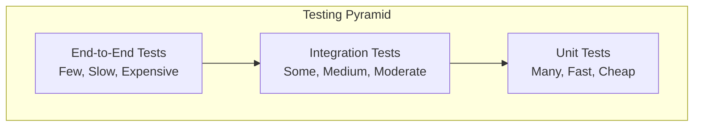

# Testing Guide

Comprehensive testing strategy and implementation for ZaroPGx.

## Testing Overview

ZaroPGx uses a multi-layered testing approach to ensure reliability, performance, and correctness across all components.

### Testing Pyramid



**Test Distribution:**
- **Unit Tests**: 70% - Fast, isolated, comprehensive
- **Integration Tests**: 20% - Service interactions, API endpoints
- **End-to-End Tests**: 10% - Complete workflows, user scenarios

## Test Structure

### Directory Organization

```
tests/
├── unit/                    # Unit tests
│   ├── api/                # API unit tests
│   ├── services/           # Service unit tests
│   ├── utils/              # Utility function tests
│   └── models/             # Model tests
├── integration/            # Integration tests
│   ├── api/                # API integration tests
│   ├── services/           # Service integration tests
│   └── database/           # Database integration tests
├── e2e/                    # End-to-end tests
│   ├── workflows/          # Complete workflow tests
│   └── user_scenarios/     # User scenario tests
├── fixtures/               # Test fixtures
├── data/                   # Test data files
│   ├── valid/              # Valid test files
│   ├── invalid/            # Invalid test files
│   └── edge_cases/         # Edge case files
├── conftest.py             # Test configuration
└── pytest.ini             # Pytest configuration
```

## Unit Testing

### Test Structure

**Basic unit test:**
```python
# tests/unit/api/test_upload.py
import pytest
from unittest.mock import Mock, patch
from fastapi.testclient import TestClient
from app.main import app
from app.api.models import UploadResponse

client = TestClient(app)

class TestUploadAPI:
    def test_upload_valid_file(self):
        """Test uploading a valid VCF file."""
        with open("tests/data/valid/sample.vcf", "rb") as f:
            response = client.post(
                "/upload/genomic-data",
                files={"file": f},
                data={"sample_identifier": "test_sample"}
            )
        
        assert response.status_code == 200
        data = response.json()
        assert "job_id" in data
        assert data["status"] == "uploaded"
        assert isinstance(data, UploadResponse)

    def test_upload_invalid_file(self):
        """Test uploading an invalid file format."""
        with open("tests/data/invalid/sample.txt", "rb") as f:
            response = client.post(
                "/upload/genomic-data",
                files={"file": f}
            )
        
        assert response.status_code == 400
        assert "error" in response.json()

    @patch('app.services.workflow_service.WorkflowService.create_workflow')
    def test_upload_workflow_creation(self, mock_create_workflow):
        """Test that workflow is created on upload."""
        mock_create_workflow.return_value = "workflow_123"
        
        with open("tests/data/valid/sample.vcf", "rb") as f:
            response = client.post(
                "/upload/genomic-data",
                files={"file": f}
            )
        
        assert response.status_code == 200
        mock_create_workflow.assert_called_once()
```

### Mocking and Fixtures

**Test fixtures:**
```python
# tests/conftest.py
import pytest
from sqlalchemy import create_engine
from sqlalchemy.orm import sessionmaker
from app.api.db import Base, get_db
from app.main import app

# Test database
SQLALCHEMY_DATABASE_URL = "sqlite:///./test.db"
engine = create_engine(SQLALCHEMY_DATABASE_URL, connect_args={"check_same_thread": False})
TestingSessionLocal = sessionmaker(autocommit=False, autoflush=False, bind=engine)

@pytest.fixture
def db_session():
    """Create a test database session."""
    Base.metadata.create_all(bind=engine)
    session = TestingSessionLocal()
    yield session
    session.close()
    Base.metadata.drop_all(bind=engine)

@pytest.fixture
def client(db_session):
    """Create a test client with database session."""
    def override_get_db():
        yield db_session
    
    app.dependency_overrides[get_db] = override_get_db
    with TestClient(app) as test_client:
        yield test_client
    app.dependency_overrides.clear()

@pytest.fixture
def sample_vcf_file():
    """Provide a sample VCF file for testing."""
    return "tests/data/valid/sample.vcf"

@pytest.fixture
def mock_pharmcat_service():
    """Mock PharmCAT service responses."""
    with patch('app.services.pharmcat_service.PharmCATService') as mock:
        mock.return_value.analyze.return_value = {
            "status": "completed",
            "results": {"CYP2D6": "*1/*2"}
        }
        yield mock
```

### Service Testing

**Service unit tests:**
```python
# tests/unit/services/test_pharmcat_service.py
import pytest
from unittest.mock import Mock, patch
from app.services.pharmcat_service import PharmCATService
from app.api.models import FileAnalysis

class TestPharmCATService:
    def test_analyze_vcf_success(self):
        """Test successful VCF analysis."""
        service = PharmCATService()
        
        with patch('httpx.AsyncClient.post') as mock_post:
            mock_response = Mock()
            mock_response.json.return_value = {
                "status": "completed",
                "results": {"CYP2D6": "*1/*2"}
            }
            mock_post.return_value = mock_response
            
            result = await service.analyze_vcf("test.vcf")
            
            assert result["status"] == "completed"
            assert "CYP2D6" in result["results"]

    def test_analyze_vcf_failure(self):
        """Test VCF analysis failure."""
        service = PharmCATService()
        
        with patch('httpx.AsyncClient.post') as mock_post:
            mock_post.side_effect = Exception("Service unavailable")
            
            with pytest.raises(Exception):
                await service.analyze_vcf("test.vcf")
```

## Integration Testing

### API Integration Tests

**API endpoint integration:**
```python
# tests/integration/api/test_upload_workflow.py
import pytest
from fastapi.testclient import TestClient
from app.main import app

client = TestClient(app)

class TestUploadWorkflow:
    def test_complete_upload_workflow(self, db_session):
        """Test complete upload to completion workflow."""
        # Upload file
        with open("tests/data/valid/sample.vcf", "rb") as f:
            upload_response = client.post(
                "/upload/genomic-data",
                files={"file": f},
                data={"sample_identifier": "integration_test"}
            )
        
        assert upload_response.status_code == 200
        job_id = upload_response.json()["job_id"]
        
        # Check status
        status_response = client.get(f"/upload/status/{job_id}")
        assert status_response.status_code == 200
        
        # Wait for completion (in real test, use proper waiting)
        import time
        time.sleep(5)
        
        # Check final status
        final_status = client.get(f"/upload/status/{job_id}")
        assert final_status.status_code == 200
        
        # Get reports
        reports_response = client.get(f"/reports/{job_id}")
        assert reports_response.status_code == 200
        assert "pdf_report_url" in reports_response.json()
```

### Database Integration Tests

**Database integration:**
```python
# tests/integration/database/test_workflow_models.py
import pytest
from sqlalchemy.orm import Session
from app.api.models import Workflow, WorkflowStep, Patient

class TestWorkflowModels:
    def test_create_workflow(self, db_session: Session):
        """Test creating a workflow with steps."""
        # Create patient
        patient = Patient(identifier="test_patient")
        db_session.add(patient)
        db_session.commit()
        
        # Create workflow
        workflow = Workflow(
            id="test_workflow",
            patient_id=patient.id,
            status="processing"
        )
        db_session.add(workflow)
        db_session.commit()
        
        # Create workflow step
        step = WorkflowStep(
            workflow_id=workflow.id,
            step_name="file_validation",
            status="completed",
            step_order=1
        )
        db_session.add(step)
        db_session.commit()
        
        # Verify
        assert workflow.id == "test_workflow"
        assert len(workflow.steps) == 1
        assert workflow.steps[0].step_name == "file_validation"

    def test_workflow_status_update(self, db_session: Session):
        """Test updating workflow status."""
        workflow = Workflow(
            id="test_workflow",
            patient_id=1,
            status="processing"
        )
        db_session.add(workflow)
        db_session.commit()
        
        # Update status
        workflow.status = "completed"
        db_session.commit()
        
        # Verify
        updated_workflow = db_session.query(Workflow).filter_by(id="test_workflow").first()
        assert updated_workflow.status == "completed"
```

### Service Integration Tests

**Service integration:**
```python
# tests/integration/services/test_pharmcat_integration.py
import pytest
from app.services.pharmcat_service import PharmCATService
from app.api.models import FileAnalysis

class TestPharmCATIntegration:
    @pytest.mark.asyncio
    async def test_pharmcat_service_integration(self):
        """Test integration with actual PharmCAT service."""
        service = PharmCATService()
        
        # This test requires PharmCAT service to be running
        result = await service.analyze_vcf("tests/data/valid/sample.vcf")
        
        assert result["status"] in ["completed", "processing"]
        if result["status"] == "completed":
            assert "results" in result

    @pytest.mark.asyncio
    async def test_pharmcat_error_handling(self):
        """Test error handling in PharmCAT service."""
        service = PharmCATService()
        
        # Test with invalid file
        with pytest.raises(Exception):
            await service.analyze_vcf("nonexistent.vcf")
```

## End-to-End Testing

### Workflow E2E Tests

**Complete workflow test:**
```python
# tests/e2e/workflows/test_vcf_processing_workflow.py
import pytest
import time
from fastapi.testclient import TestClient
from app.main import app

client = TestClient(app)

class TestVCFProcessingWorkflow:
    def test_vcf_upload_to_report_generation(self):
        """Test complete VCF upload to report generation workflow."""
        # Step 1: Upload VCF file
        with open("tests/data/valid/sample.vcf", "rb") as f:
            upload_response = client.post(
                "/upload/genomic-data",
                files={"file": f},
                data={
                    "sample_identifier": "e2e_test_sample",
                    "reference_genome": "hg38",
                    "pypgx_enabled": "true"
                }
            )
        
        assert upload_response.status_code == 200
        job_id = upload_response.json()["job_id"]
        
        # Step 2: Monitor processing
        max_wait_time = 300  # 5 minutes
        start_time = time.time()
        
        while time.time() - start_time < max_wait_time:
            status_response = client.get(f"/upload/status/{job_id}")
            assert status_response.status_code == 200
            
            status_data = status_response.json()
            if status_data["status"] == "completed":
                break
            elif status_data["status"] == "failed":
                pytest.fail(f"Processing failed: {status_data.get('message', 'Unknown error')}")
            
            time.sleep(10)  # Wait 10 seconds between checks
        
        # Step 3: Verify completion
        final_status = client.get(f"/upload/status/{job_id}")
        assert final_status.status_code == 200
        assert final_status.json()["status"] == "completed"
        
        # Step 4: Get reports
        reports_response = client.get(f"/reports/{job_id}")
        assert reports_response.status_code == 200
        
        reports_data = reports_response.json()
        assert "pdf_report_url" in reports_data
        assert "html_report_url" in reports_data
        
        # Step 5: Download and verify reports
        pdf_response = client.get(reports_data["pdf_report_url"])
        assert pdf_response.status_code == 200
        assert pdf_response.headers["content-type"] == "application/pdf"
        
        html_response = client.get(reports_data["html_report_url"])
        assert html_response.status_code == 200
        assert "text/html" in html_response.headers["content-type"]
```

### User Scenario Tests

**User scenario test:**
```python
# tests/e2e/user_scenarios/test_clinician_workflow.py
import pytest
from fastapi.testclient import TestClient
from app.main import app

client = TestClient(app)

class TestClinicianWorkflow:
    def test_clinician_analyzes_patient_sample(self):
        """Test complete clinician workflow from upload to report review."""
        # Step 1: Clinician uploads patient sample
        with open("tests/data/valid/patient_sample.vcf", "rb") as f:
            upload_response = client.post(
                "/upload/genomic-data",
                files={"file": f},
                data={
                    "sample_identifier": "PATIENT_001",
                    "reference_genome": "hg38"
                }
            )
        
        assert upload_response.status_code == 200
        job_id = upload_response.json()["job_id"]
        
        # Step 2: Wait for processing (in real test, use proper waiting)
        time.sleep(30)
        
        # Step 3: Check processing status
        status_response = client.get(f"/upload/status/{job_id}")
        assert status_response.status_code == 200
        
        # Step 4: Get analysis results
        reports_response = client.get(f"/reports/{job_id}")
        assert reports_response.status_code == 200
        
        reports_data = reports_response.json()
        
        # Step 5: Verify clinical data
        assert "diplotypes" in reports_data
        assert "recommendations" in reports_data
        
        # Verify specific pharmacogene results
        diplotypes = reports_data["diplotypes"]
        assert "CYP2D6" in diplotypes
        assert "CYP2C19" in diplotypes
        
        # Verify recommendations
        recommendations = reports_data["recommendations"]
        assert len(recommendations) > 0
        
        # Step 6: Download clinical report
        pdf_response = client.get(reports_data["pdf_report_url"])
        assert pdf_response.status_code == 200
        
        # Verify PDF contains expected content
        pdf_content = pdf_response.content
        assert b"EXECUTIVE SUMMARY" in pdf_content
        assert b"CYP2D6" in pdf_content
```

## Performance Testing

### Load Testing

**Load test implementation:**
```python
# tests/performance/test_load.py
import pytest
import asyncio
import aiohttp
from concurrent.futures import ThreadPoolExecutor

class TestLoadPerformance:
    @pytest.mark.performance
    def test_concurrent_uploads(self):
        """Test system performance under concurrent uploads."""
        async def upload_file(session, file_path, sample_id):
            with open(file_path, "rb") as f:
                data = aiohttp.FormData()
                data.add_field("file", f, filename="sample.vcf")
                data.add_field("sample_identifier", sample_id)
                
                async with session.post(
                    "http://localhost:8765/upload/genomic-data",
                    data=data
                ) as response:
                    return await response.json()
        
        async def run_load_test():
            async with aiohttp.ClientSession() as session:
                tasks = []
                for i in range(10):  # 10 concurrent uploads
                    task = upload_file(session, "tests/data/valid/sample.vcf", f"load_test_{i}")
                    tasks.append(task)
                
                results = await asyncio.gather(*tasks)
                return results
        
        # Run load test
        results = asyncio.run(run_load_test())
        
        # Verify all uploads succeeded
        for result in results:
            assert "job_id" in result
            assert result["status"] == "uploaded"

    @pytest.mark.performance
    def test_api_response_times(self):
        """Test API response times under load."""
        import time
        
        start_time = time.time()
        
        # Make multiple requests
        for _ in range(100):
            response = client.get("/health")
            assert response.status_code == 200
        
        end_time = time.time()
        avg_response_time = (end_time - start_time) / 100
        
        # Assert response time is acceptable
        assert avg_response_time < 0.1  # 100ms average
```

### Memory Testing

**Memory usage test:**
```python
# tests/performance/test_memory.py
import pytest
import psutil
import os

class TestMemoryUsage:
    def test_memory_usage_during_processing(self):
        """Test memory usage during file processing."""
        process = psutil.Process(os.getpid())
        initial_memory = process.memory_info().rss
        
        # Upload and process file
        with open("tests/data/valid/large_sample.vcf", "rb") as f:
            response = client.post(
                "/upload/genomic-data",
                files={"file": f},
                data={"sample_identifier": "memory_test"}
            )
        
        assert response.status_code == 200
        
        # Wait for processing
        time.sleep(30)
        
        # Check memory usage
        final_memory = process.memory_info().rss
        memory_increase = final_memory - initial_memory
        
        # Assert memory increase is reasonable (less than 1GB)
        assert memory_increase < 1024 * 1024 * 1024
```

## Test Data Management

### Test Data Organization

**Test data structure:**
```
tests/data/
├── valid/                  # Valid test files
│   ├── sample.vcf         # Small VCF file
│   ├── large_sample.vcf   # Large VCF file
│   ├── sample.bam         # BAM file
│   └── sample.fastq       # FASTQ file
├── invalid/               # Invalid test files
│   ├── corrupted.vcf      # Corrupted VCF
│   ├── wrong_format.txt   # Wrong format
│   └── empty.vcf          # Empty file
├── edge_cases/            # Edge case files
│   ├── no_variants.vcf    # VCF with no variants
│   ├── single_variant.vcf # VCF with one variant
│   └── large_header.vcf   # VCF with large header
└── fixtures/              # Test fixtures
    ├── patients.json      # Patient data
    └── workflows.json     # Workflow data
```

### Test Data Generation

**Generate test data:**
```python
# tests/fixtures/generate_test_data.py
import json
import random
from pathlib import Path

def generate_test_vcf(output_path: Path, num_variants: int = 100):
    """Generate a test VCF file with specified number of variants."""
    with open(output_path, "w") as f:
        # Write VCF header
        f.write("##fileformat=VCFv4.2\n")
        f.write("##reference=GRCh38\n")
        f.write("##contig=<ID=1,length=248956422>\n")
        f.write("##INFO=<ID=AC,Number=A,Type=Integer,Description=\"Allele count\">\n")
        f.write("##FORMAT=<ID=GT,Number=1,Type=String,Description=\"Genotype\">\n")
        f.write("#CHROM\tPOS\tID\tREF\tALT\tQUAL\tFILTER\tINFO\tFORMAT\tSAMPLE\n")
        
        # Generate variants
        for i in range(num_variants):
            chrom = random.choice(["1", "2", "3", "4", "5"])
            pos = random.randint(1000, 1000000)
            ref = random.choice(["A", "T", "G", "C"])
            alt = random.choice(["A", "T", "G", "C"])
            qual = random.randint(20, 100)
            gt = random.choice(["0/0", "0/1", "1/1"])
            
            f.write(f"{chrom}\t{pos}\t.\t{ref}\t{alt}\t{qual}\tPASS\tAC=1\tGT\t{gt}\n")

def generate_test_patients(output_path: Path, num_patients: int = 10):
    """Generate test patient data."""
    patients = []
    for i in range(num_patients):
        patient = {
            "id": f"patient_{i:03d}",
            "identifier": f"TEST_{i:03d}",
            "created_at": "2024-01-15T10:00:00Z"
        }
        patients.append(patient)
    
    with open(output_path, "w") as f:
        json.dump(patients, f, indent=2)
```

## Test Configuration

### Pytest Configuration

**pytest.ini:**
```ini
[tool:pytest]
testpaths = tests
python_files = test_*.py
python_classes = Test*
python_functions = test_*
addopts = 
    -v
    --tb=short
    --strict-markers
    --disable-warnings
    --cov=app
    --cov-report=html
    --cov-report=term-missing
    --cov-fail-under=80
markers =
    unit: Unit tests
    integration: Integration tests
    e2e: End-to-end tests
    performance: Performance tests
    slow: Slow tests
    requires_services: Tests requiring external services
```

### Test Environment Setup

**Test environment configuration:**
```python
# tests/conftest.py
import os
import pytest
from sqlalchemy import create_engine
from sqlalchemy.orm import sessionmaker
from app.api.db import Base, get_db
from app.main import app

# Set test environment
os.environ["TESTING"] = "true"
os.environ["DB_HOST"] = "localhost"
os.environ["DB_PORT"] = "5432"
os.environ["DB_NAME"] = "test_cpic_db"
os.environ["DB_USER"] = "test_user"
os.environ["DB_PASSWORD"] = "test_password"

@pytest.fixture(scope="session")
def test_db_engine():
    """Create test database engine."""
    engine = create_engine("sqlite:///./test.db")
    Base.metadata.create_all(bind=engine)
    yield engine
    Base.metadata.drop_all(bind=engine)

@pytest.fixture
def test_db_session(test_db_engine):
    """Create test database session."""
    SessionLocal = sessionmaker(autocommit=False, autoflush=False, bind=test_db_engine)
    session = SessionLocal()
    yield session
    session.close()

@pytest.fixture
def test_client(test_db_session):
    """Create test client with database session."""
    def override_get_db():
        yield test_db_session
    
    app.dependency_overrides[get_db] = override_get_db
    with TestClient(app) as client:
        yield client
    app.dependency_overrides.clear()
```

## Continuous Integration

### GitHub Actions

**CI workflow:**
```yaml
# .github/workflows/test.yml
name: Tests

on:
  push:
    branches: [ main, develop ]
  pull_request:
    branches: [ main ]

jobs:
  test:
    runs-on: ubuntu-latest
    
    services:
      postgres:
        image: postgres:15
        env:
          POSTGRES_PASSWORD: postgres
          POSTGRES_DB: test_cpic_db
        options: >-
          --health-cmd pg_isready
          --health-interval 10s
          --health-timeout 5s
          --health-retries 5
    
    steps:
    - uses: actions/checkout@v3
    
    - name: Set up Python
      uses: actions/setup-python@v4
      with:
        python-version: '3.12'
    
    - name: Install dependencies
      run: |
        pip install -e .
        pip install -r requirements-dev.txt
    
    - name: Run unit tests
      run: pytest tests/unit -m "not slow"
    
    - name: Run integration tests
      run: pytest tests/integration -m "not slow"
    
    - name: Run E2E tests
      run: pytest tests/e2e -m "not slow"
    
    - name: Upload coverage
      uses: codecov/codecov-action@v3
```

## Test Best Practices

### Writing Good Tests

**Test naming:**
- Use descriptive names: `test_upload_valid_vcf_file_success`
- Include the scenario being tested
- Use consistent naming patterns

**Test structure:**
- Arrange: Set up test data and mocks
- Act: Execute the code under test
- Assert: Verify the expected outcome

**Test isolation:**
- Each test should be independent
- Use fixtures for common setup
- Clean up after each test

### Test Maintenance

**Regular maintenance:**
- Update tests when code changes
- Remove obsolete tests
- Refactor duplicate test code
- Keep test data up to date

**Test documentation:**
- Document complex test scenarios
- Explain test data requirements
- Document test environment setup
- Keep test README updated

## Next Steps

- **Development Setup**: {doc}`development-setup`
- **Architecture**: {doc}`architecture`
- **API Reference**: {doc}`api-reference`
- **Contributing**: {doc}`contributing`
